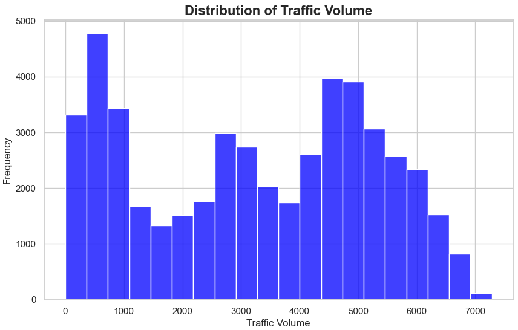
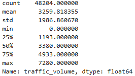

# Finding Heavy Traffic Indicators on the I-94

## Introduction
In this project, I'll be analyzing a dataset on westbound traffic on the I-94 Interstate highway. The goal is to identify key indicators of heavy traffic on the I-94, such as weather conditions, time of day, and day of the week. The dataset, which can be found in the ```Metro_Interstate_Traffic_Volume.csv``` file, was sourced from the [UCI Machine Learning Repository](https://archive.ics.uci.edu/dataset/492/metro+interstate+traffic+volume). All analysis code is contained in the ```I94.ipynb``` file.  

To achieve these findings, we use various analytical techniques in Python, leveraging libraries like Pandas, Matplotlib, and Seaborn. Our approach involves examining summary statistics, histogram distributions, and time-based patterns to identify factors that significantly impact traffic volume.

---
## Time Indicators for Heavy Traffic on the I-94
We start by importing the necessary libraries and then examine the dataset's rows to gather more information, with a focus on determining if any cleaning is required.
```
import pandas as pd
import numpy as np
from matplotlib import pyplot as plt
%matplotlib inline
traffic = pd.read_csv('Metro_Interstate_Traffic_Volume.csv')
```
```
traffic.head()
```

```
traffic.tail()
```

```
traffic.info()
```


### Initial Inspection
Upon inspection, we can see that the dataset contains 9 columns, and all rows are non-null with the correct data types. This suggests that the data is generally clean and well-structured. However, the ```date_time``` column is currently not in the datetime format, so we'll need to convert it to the proper datetime data type, which we'll address later in the analysis. Once we make this adjustment, the dataset will be ready for analysis.  

For now, we will begin our analysis by visualizing the distribution of traffic volume on the I-94:
```
#Create histogram for distribution of traffic volume
import seaborn as sns
sns.set_theme()

# Set Seaborn style
sns.set(style='whitegrid')

#Plotting
plt.figure(figsize=(10,6))
sns.histplot(traffic['traffic_volume'], bins=20, color='blue')
plt.title('Distribution of Traffic Volume', fontsize=16, fontweight='bold')
plt.xlabel('Traffic Volume')
plt.ylabel('Frequency')
plt.show()
```

```
traffic['traffic_volume'].describe()
```


### Observations on Traffic Volume Distribution
#### Summary Statistics:
- **Count:** There are 48,204 entries in the ```traffic_volume``` column, indicating a fairly large dataset.
- **Mean:** The average traffic volume is approximately 3,260 cars per hour.
- **Standard Deviation:** The standard deviation is approximately 1,987 cars, suggesting a high variability in traffic volume.
- **Min and Max:** The traffic volume ranges from 0 to 7,280 vehicles per hour.
- **25th Percentile (Q1):** 25% of the data has traffic volume less than 1,193.
- **50th Percentile (Q2):** half of the data has traffic volume less than 3,380.
- **75th Percentile (Q3):** 25% of the data has traffic volume greater than 4,933.
#### Histogram Observations:
- The histogram shows several peaks, indicating that traffic volume has multiple common values.
- The distribution is right-skewed, with a significant number of observations showing a traffic volume of 0, suggesting periods of no traffic.
- Notable peaks occur in the 0-1000 range and the 4,000-5,000 range.
- The data is spread across a broad range of values, with noticeable frequencies extending up to the maximum value of 7,000.
#### Insights and Hypothesis:
Based on these observations, we can begin to hypothesize:
1. Given the large number of observations with traffic volumes of 0, we can hypothesize that this may be due to nighttime periods when traffic is minimal or nonexistent.
2. The significant number of observations in the 4,000-5,000 range could be attributed to rush hour periods during the day.

To test our first hypothesis, we'll isolate the daytime and nighttime data and compare the traffic volume distributions for these periods. This analysis will help us determine if the observed patterns are indeed influenced by the time of day.
```
#Isloate daytime and nighttime data into two seperate dataframes
traffic['date_time'] = pd.to_datetime(traffic['date_time'])
daytime = traffic[(traffic['date_time'].dt.hour >= 7) & (traffic['date_time'].dt.hour < 19)]
nighttime = traffic[(traffic['date_time'].dt.hour >= 19) | (traffic['date_time'].dt.hour < 7)]
```
```
#Create the figure for two subplots
plt.figure(figsize=(14,8))

#Plot daytime traffic volume distribution
plt.subplot(1,2,1)
sns.histplot(daytime['traffic_volume'], bins=15, color='blue')
plt.xlim(0, 7500)
plt.ylim(0, 8000)
plt.title('Daytime Traffic Volume', fontsize=16, fontweight='bold')
plt.xlabel('Volume')
plt.ylabel('Frequency')

#Plot nighttime traffic volume distribution
plt.subplot(1,2,2)
sns.histplot(nighttime['traffic_volume'], bins=15, color='orange')
plt.xlim(0, 7500)
plt.ylim(0, 8000)
plt.title('Nighttime Traffic Volume', fontsize=16, fontweight='bold')
plt.xlabel('Volume')
plt.ylabel('Frequency')

plt.show()
```


### Analysis of Daytime and Nighttime Traffic Volume Distributions
#### Daytime Traffic Volume Distribution Observations
The distribution is left-skewed, with a noticeable peak in the 4,000-5,000 vehicles per hour range, indicating that most traffic volume observations are concentrated in this area. It’s also worth noting the relatively few observations in the 0-3,000 range.
#### Nighttime Traffic Volume Distribution Observations
The distribution is right-skewed, with a significant concentration of observations in the 0-1,000 vehicles per hour range, indicating that there is typically very little traffic at night.
#### Conclusion
We can therefore conclude that this information supports our hypothesis that the high number of observations with no traffic is due to the nighttime period. Since our goal is to identify indicators of heavy traffic, we will focus on the daytime data, where heavy traffic is more prevalent and relatively rare at night.

```
#Create a series of mean traffic volumes grouped by month
daytime['month'] = daytime['date_time'].dt.month
by_month = daytime[['month', 'traffic_volume']].groupby('month').mean()
by_month
```
```
#Plot monthly traffic volume
plt.figure(figsize=(14,7))
sns.lineplot(by_month, marker='o', legend=False)
plt.xticks(range(1,len(by_month) +1))
plt.title('Monthly Traffic Volume', fontsize=16, fontweight='bold')
plt.xlabel('Month')
plt.ylabel('Traffic Volume')
plt.show()
```


### Analysis of Monthly Traffic Volume Distribution
#### Distribution Observations:
1. Traffic generally increases from January through May, remaining relatively stable and high with minor fluctuations from March to June.
2. Traffic is lowest in December and peaks in August.
3. There is a noticeable dip in traffic around July, likely due to vacations or road construction, leading to less traffic.
4. A sharp decrease in traffic is observed from October to December, possibly due to the holiday season when many people are off work or traveling.
#### Conclusion
Based on our observations, we can conclude that traffic is highest between March and June, likely due to people commuting to work and the minimal number of holidays during this period. Traffic drops significantly in July, as well as from November through January, likely due to summer vacations in July and the holiday season.
```
#Create a series of mean traffic volumes grouped by day
daytime['dayofweek'] = daytime['date_time'].dt.dayofweek
by_dayofweek = daytime[['dayofweek', 'traffic_volume']].groupby('dayofweek').mean()
by_dayofweek
```
```
#Plot daily traffic volume
plt.figure(figsize=(14,7))
sns.lineplot(by_dayofweek, marker='o', legend=False)
plt.title('Daily Traffic Volume', fontsize=16, fontweight='bold')
plt.xlabel('Day of the week (0 is Monday, 6 is Sunday)')
plt.ylabel('Traffic Volume')
plt.show()
```


### Analysis of Daily Traffic Volume Distribution
#### Distribution Observations:
1. Traffic is highest on business days (Monday through Friday), peaking on Thursday.
2. Among business days, Mondays have relatively lower traffic, likely due to flexible work schedules.
3. There is a noticeable dip in traffic starting on Saturday, with Sunday seeing the least amount of traffic for the entire week.
#### Conclusion
We can therefore conclude that traffic is highest on business days and lowest on weekends. This suggests that commuting to work is a significant factor contributing to high traffic volumes. 

To further investigate these patterns, we split the data into two groups: business days and weekends. By examining how traffic volume changes by the hour for each group, we can gain deeper insights into the differences in traffic behavior between weekdays and weekends.
```
#Isolate bussiness days and weekends into two seperate dataframes
daytime['hour'] = daytime['date_time'].dt.hour
bussiness_days = daytime.copy()[daytime['dayofweek'] <= 4]
weekend = daytime.copy()[daytime['dayofweek'] >= 5]

#Create a series of mean traffic volumes grouped by buissiness day hours
by_hour_business = bussiness_days[['hour', 'traffic_volume']].groupby('hour').mean()

#Create a series of mean traffic volumes grouped by weekend hours
by_hour_weekend = weekend[['hour', 'traffic_volume']].groupby('hour').mean()
```
```
#Create the figure for the two subplots
plt.figure(figsize=(14,8))

#Plot business days traffic volume
plt.subplot(1,2,1)
sns.lineplot(by_hour_business, marker='o', legend=False)
plt.ylim(1000, 7000)
plt.title('Business Days Traffic Volume', fontsize=16, fontweight='bold')
plt.xlabel('Hour')
plt.ylabel('Traffic Volume')

plt.subplot(1,2,2)
sns.lineplot(by_hour_weekend, marker='o', legend=False)
plt.ylim(1000, 7000)
plt.title('Weekends Traffic Volume', fontsize=16, fontweight='bold')
plt.xlabel('Hour')
plt.ylabel('Traffic Volume')

plt.show()
```


### Analysis of Traffic Volume by Time of Day
#### Business Days Traffic Volume
- Traffic peaks at 7 AM and 4 PM, likely due to people commuting to and from work.
- Traffic is lowest from 10AM to 1PM, reflecting regular buisness operations and fewer commuters on the road.
- Traffic increases sharply between 2 PM and 4 PM, indicating the afternoon commute.
- After 5 PM, traffic declines significantly, reflecting fewer vehicles on the road in the late evening.
#### Weekends Traffic Volume
- Overall traffic during the weekends is significantly lower compared to business days.
- Traffic is lowest at 7 AM and steadily increases until 12 PM, likely because there’s no work commute on weekends.
- Traffic peaks at 12 PM and remains stable until 4 PM, suggesting that people are commuting for leisure activities.
- After 4 PM, traffic declines, likely as people return home from their activities.
#### Conclusion
In conclusion, traffic is significantly higher on business days, peaking during typical commuting hours at 7 AM and 4 PM, indicating work-related travel as a key factor. On weekends, traffic is lower, with a gradual increase starting later in the morning, peaking around midday, and declining after 4 PM, suggesting leisure activities drive weekend traffic. These insights can aid in better traffic management, especially during peak hours.

## Summary of Findings: Time Indicators for Heavy Traffic on the I-94
### 1. Monthly Traffic Volume
- Traffic volume fluctuates across different months.
- Generally, traffic volume is higher during the warmer months (March to October) compared to the colder months (November to March).
- Notably low traffic volumes occur in July, likely due to vacations, and in December, possibly influenced by harsh weather and the holiday season.
### 2. Daily Traffic Volume
- The highest traffic volumes occur during business days (Monday to Friday).
- There is a noticeable decrease in traffic volume after Friday, with Sunday having the least traffic of the entire week.
- Monday experiences the lowest traffic of all business days, likely due to flexible work schedules.
### 3. Hourly Traffic Volume
#### Buisness Days
- **Morning Rush Hour:** Traffic volume peaks at 7AM, slowly decreasing until 10AM.
- **Evening Rush Hour:** Traffic increases sharply between 2PM and 4PM, peaking at around 4PM.
- **Buisness Hours:** Lower traffic volume between 10AM and 2PM.
- **Nighttime:** Significant decrease in traffic at around 7PM.
#### Weekends
- **Morning Activity:** Traffic volume is notably low at 7AM, steadily increasing until it stabalizes at 12PM.
- **Steady Afternoon Volume:** Traffic volume remains steady from 12PM to 4PM.
- **Evening Decrease:** Decrease in traffic volume after 4PM.
- **No Notable Rush Hours:** More evenly distributed traffic throughout the day.
### Conclusion
The analysis of traffic volume on the I-94 Interstate shows distinct patterns based on time indicators. Traffic is generally heavier during the warmer months, particularly on business days, with significant peaks during morning and evening rush hours. Weekends and colder months see reduced traffic volumes, with Sundays and holidays, such as July and December, experiencing the lowest traffic levels.

---
## Weather Indicators for Heavy Traffic on the I-94
While time indicators are a key factor in heavy traffic on the I-94, they are not the sole contributors. Weather conditions also play a significant role in influencing traffic volume. To explore this further, we will examine the correlation between traffic volume and various numerical weather variables.
```
#Create correlation table between traffic volume and numerical weather columns
daytime[['traffic_volume', 'temp', 'rain_1h', 'snow_1h', 'clouds_all']].corr().head(n=1)
```

```
#Plot traffic volume vs temperature scatter plot
plt.figure(figsize=(14,7))
sns.scatterplot(x=daytime['traffic_volume'], y=daytime['temp'])
plt.title('Traffic Volume vs Temperature', fontsize=16, fontweight='bold')
plt.xlabel('Traffic Volume')
plt.ylabel('Temperature')
plt.show()
```


### Correlation Analysis of Traffic Volume and Weather
Here are the correlation values between ```traffic_volume``` and the numerical weather columns:

